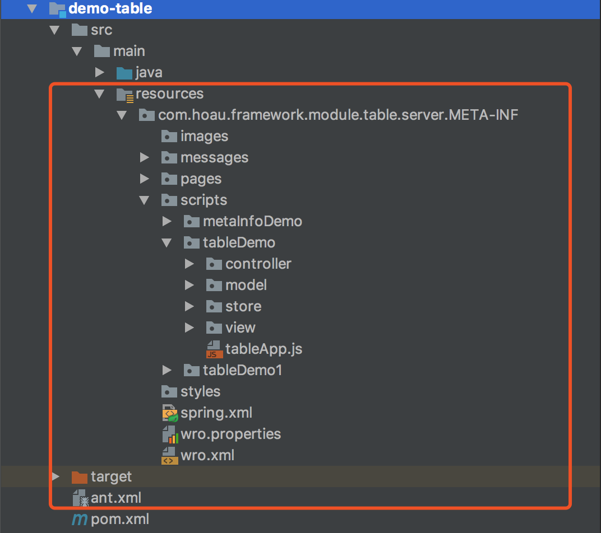

# ExtJs5.x Example 学习文档
-------
## Catalog

[TOC]

项目使用springMvc + Extjs5x,主要介绍前后端交互以及界面组件的mvc模式简单搭建使用,
开发同事可以通过阅读本文档来帮助开发。更多`examples`请参考 [Extjs 5.0 examples](http://examples.sencha.com/extjs/5.0.0/examples/kitchensink/)

----
## Introduction
>* package 创建规则及原理
* resource 压缩使用方法
* ext 处理国际化、权限控制等使用方法
* Extjs5.x Mvc模式及组件介绍
* 分页插件集成
* 开发中的一些补充说明

----
# package 创建规则及原理
### 结构如下图

  >* PS : 原理请查看基础平台filter的实现原理文档

----
# resource 压缩使用方法
>* pom.xml的配置
	* 只需在当前模块的pom中配置如下代码
	 ```xml
      <build>
        <plugins>
            <plugin>
                <groupId>ro.isdc.wro4j</groupId>
                <artifactId>wro4j-maven-plugin</artifactId>
            </plugin>
        </plugins>
    </build>
    ```
* jsp中ext的配置
	* jsp中的ext标签写法
* wro.xml压缩文件配置
